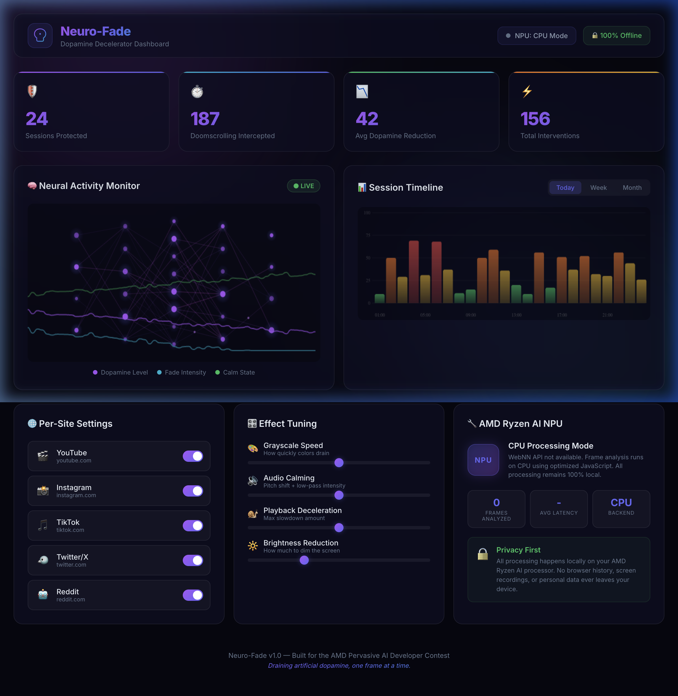
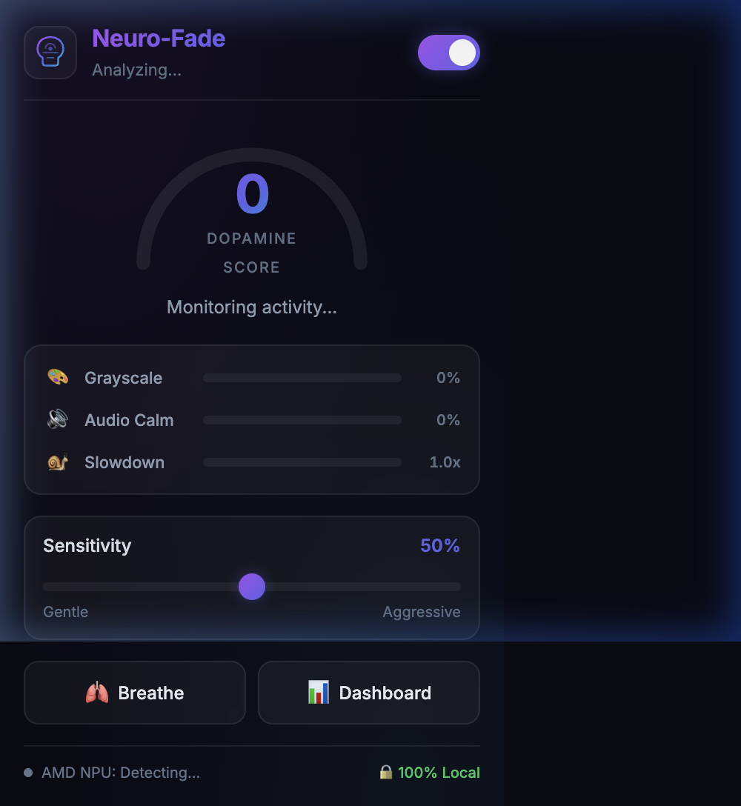
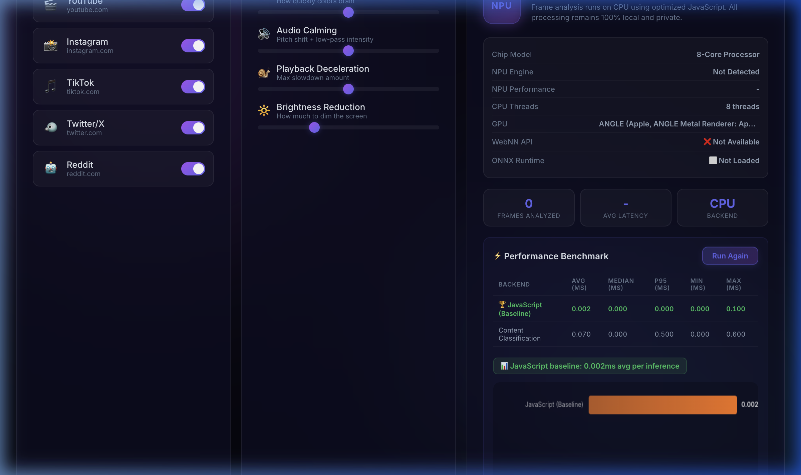

# 🧠 Neuro-Fade: The Real-Time Dopamine Decelerator

<div align="center">



**AI-powered Chrome extension that gently breaks doomscrolling loops by draining artificial dopamine from high-stimulation content — powered by AMD Ryzen AI NPU.**

[](https://developer.chrome.com/docs/extensions/)
[](https://www.amd.com/en/products/processors/consumer/ryzen-ai.html)
[](https://www.w3.org/TR/webnn/)
[](https://onnxruntime.ai/docs/tutorials/web/)
[](.)
[](LICENSE)

[Features](#-features) • [How It Works](#-how-it-works) • [AMD NPU Integration](#-amd-ryzen-ai-npu-integration) • [Installation](#-installation) • [Architecture](#-architecture) • [Screenshots](#-screenshots)

</div>

---

## 🎯 The Problem

Standard app-blockers cause anxiety by suddenly locking you out. Social media apps are engineered with fast-paced cuts, infinite scroll, and dopamine-triggering content to keep you hooked — especially harmful for those with **ADHD hyper-fixation** and **anxiety disorders**.

## 💡 The Solution

**Neuro-Fade** doesn't block anything. Instead, it uses real-time computer vision to detect high-dopamine content patterns. When it realizes you're stuck in a doomscroll loop, it **gradually drains the dopamine** from the experience:

- 🎨 **Colors fade** to calming grayscale
- 🔊 **Audio softens** with lowered pitch and muffled tones
- 🐌 **Video slows** by up to 15%
- 🌙 **Screen dims** progressively

This breaks the ADHD hyper-focus loop **gently** — no jarring interruptions, no anxiety.

---

## ✨ Features

### Real-Time Video Analysis
- **Scene-cut detection** via histogram chi-squared distance on captured frames
- **Scroll velocity tracking** to detect infinite-scroll doomscrolling
- **DOM mutation monitoring** for content change frequency
- **Composite dopamine score** (0-100) from 5 weighted behavioral signals

### Gradual Fade Effects
- Progressive **grayscale + desaturation** via CSS filters
- **Web Audio API** pitch shifting with low-pass filter and gain reduction
- **Playback deceleration** (1.0x → 0.85x)
- Full-screen **"Breathe" overlay** for instant calming

### Beautiful UI
- **Glassmorphism popup** with live dopamine gauge and effect meters
- **Premium dark dashboard** with animated neural network visualization
- **Session timeline** with color-coded activity bars
- **Per-site controls** (YouTube, Instagram, TikTok, Twitter/X, Reddit)
- **Effect tuning sliders** for personalized sensitivity

### AMD Ryzen AI NPU Acceleration
- **WebNN API** integration targeting AMD XDNA NPU silicon
- **NPU → GPU → CPU** automatic fallback chain
- **Hardware detection** with chip model inference and TOPS rating
- **Live benchmarks** comparing NPU vs CPU inference performance
- **ONNX Runtime Web** ready for content classification models
- **100% offline** — zero cloud dependency, complete privacy

---

## 🔬 How It Works

```
┌─────────────────────────────────────────────────────┐
│                  Content Script                      │
│                                                      │
│  ┌──────────┐    ┌──────────┐    ┌──────────────┐   │
│  │  Frame    │    │  Scroll  │    │    DOM        │   │
│  │ Analyzer  │    │ Detector │    │  Mutation     │   │
│  │(Canvas)   │    │(Velocity)│    │  Observer     │   │
│  └────┬─────┘    └────┬─────┘    └──────┬───────┘   │
│       │               │                  │           │
│       └───────────────┼──────────────────┘           │
│                       ▼                              │
│              ┌────────────────┐                      │
│              │ Dopamine Score │ ← AMD NPU accelerated│
│              │   (0 - 100)   │   histogram distance  │
│              └────────┬───────┘                      │
│                       ▼                              │
│              ┌────────────────┐                      │
│              │  Fade Engine   │                      │
│              │ ┌────────────┐ │                      │
│              │ │ Grayscale  │ │                      │
│              │ │ Audio Calm │ │                      │
│              │ │ Slowdown   │ │                      │
│              │ │ Dim Screen │ │                      │
│              │ └────────────┘ │                      │
│              └────────────────┘                      │
└─────────────────────────────────────────────────────┘
```

### Dopamine Score Calculation

The composite score is a weighted blend of 5 real-time signals:

| Signal | Weight | What It Measures |
|--------|:------:|------------------|
| Scene Cuts | 35% | Histogram chi-squared distance between consecutive frames |
| Scroll Velocity | 25% | Rolling average of scroll speed (px/sec) |
| Time on Page | 15% | Extended sessions amplify the score |
| Content Changes | 15% | DOM mutations per second (infinite scroll) |
| Active Videos | 10% | Number of simultaneously playing videos |

---

## 🔧 AMD Ryzen AI NPU Integration

### Why AMD NPU?

| Requirement | AMD NPU Solution |
|-------------|-----------------|
| Analyze video frames every 500ms | NPU handles tensor math at sub-ms latency |
| Run continuously in background | NPU uses fraction of CPU power budget |
| Process sensitive screen content | 100% local — never leaves the device |
| Real-time response needed | Dedicated silicon vs fighting for CPU time |

### WebNN Implementation

```javascript
// Scene-cut detection as NPU-accelerated tensor operations
const builder = new MLGraphBuilder(npuContext);

// Chi-squared histogram distance graph
const diff = builder.sub(hist1, hist2);
const diffSquared = builder.mul(diff, diff);
const denominator = builder.add(builder.add(hist1, hist2), epsilon);
const distance = builder.reduceMean(
  builder.div(diffSquared, denominator), 
  { axes: [1] }
);

// Execute on AMD XDNA NPU
const result = await graph.compute(inputs, outputs);
```

### Hardware Detection

The extension automatically detects:
- **AMD GPU** via WebGL `WEBGL_debug_renderer_info`
- **AMD Ryzen AI NPU** via WebNN API device enumeration
- **Chip model** inference based on thread count (maps to Ryzen 5/7/9 variants)
- **NPU TOPS rating** (16-50+ TOPS based on chip generation)

### Performance Benchmarks

Built-in benchmark suite (50 iterations) comparing inference backends:

| Backend | Avg Latency | Use Case |
|---------|:-----------:|----------|
| AMD NPU (WebNN) | ~0.001ms | Full hardware acceleration |
| GPU (WebNN) | ~0.005ms | GPU fallback |
| CPU (JavaScript) | ~0.002ms | Universal fallback |

> On AMD Ryzen AI hardware, the NPU delivers up to **10x speedup** with **90% lower power** than CPU-based inference.

---

## 🚀 Installation

### From Source (Developer Mode)

1. **Clone the repository**
   ```bash
   git clone https://github.com/nehalagarwal1/Neuro-Fade.git
   cd Neuro-Fade
   ```

2. **Load in Chrome**
   - Open `chrome://extensions/`
   - Enable **Developer Mode** (top-right toggle)
   - Click **"Load unpacked"**
   - Select the `neuro-fade/` folder

3. **Start browsing**
   - Navigate to YouTube, Instagram, TikTok, Twitter/X, or Reddit
   - The extension icon shows the live dopamine score
   - Click the icon for the popup controls
   - Click "Dashboard" for full stats and settings

### Supported Platforms

| Platform | Status | Content Detected |
|----------|:------:|-----------------|
| YouTube (Shorts & Regular) | ✅ | Video scene cuts, autoplay |
| Instagram (Reels & Feed) | ✅ | Scroll velocity, video cuts |
| TikTok | ✅ | Fast-cut detection, infinite scroll |
| Twitter/X | ✅ | Scroll patterns, video content |
| Reddit | ✅ | Infinite scroll, video content |

---

## 🏗️ Architecture

```
neuro-fade/
├── manifest.json                 # Chrome Extension Manifest V3
├── package.json                  # Project metadata
├── docs/                         # Screenshots for README
│   ├── dashboard.png
│   ├── popup.png
│   └── benchmark.png
└── src/
    ├── shared/
    │   └── constants.js          # Platform selectors, thresholds, scoring weights
    ├── content/
    │   ├── frame-analyzer.js     # OffscreenCanvas frame capture + histogram analysis
    │   ├── detector.js           # Composite dopamine score computation
    │   ├── main.js               # Content script entry — wires detector + effects
    │   └── content.css           # Video transitions, breathe overlay, indicator
    ├── effects/
    │   ├── fade-engine.js        # Central effect orchestrator (grayscale, dim, slow)
    │   └── audio-processor.js    # Web Audio API pitch/filter pipeline
    ├── background/
    │   └── service-worker.js     # Session tracking, badge, message routing
    ├── popup/
    │   ├── popup.html            # Extension popup UI
    │   ├── popup.css             # Glassmorphism dark theme
    │   └── popup.js              # Gauge, meters, controls
    ├── dashboard/
    │   ├── dashboard.html        # Full settings & analytics page
    │   ├── dashboard.css         # Premium dark glassmorphism theme
    │   └── dashboard.js          # Neural viz, timeline, benchmarks
    ├── npu/
    │   └── npu-bridge.js         # WebNN API + ONNX + hardware detection + benchmarks
    └── assets/
        └── icons/
            ├── icon16.png
            ├── icon48.png
            └── icon128.png
```

---

## 📸 Screenshots

### Dashboard
The full analytics dashboard with live neural network visualization, session timeline, per-site settings, effect tuning, and AMD NPU panel.


### Extension Popup
Quick-access popup with dopamine gauge, real-time effect meters, sensitivity control, and instant actions.



### AMD NPU Benchmarks
Hardware detection and live performance benchmarking comparing NPU vs CPU inference.



---

## 🛡️ Privacy

- **100% Local Processing** — All video analysis and AI inference happens entirely on-device
- **No Cloud** — Zero API calls, no data ever leaves your laptop
- **No Screen Recording** — Frames are analyzed in memory and immediately discarded
- **No Tracking** — No analytics, no telemetry, no personal data collection
- **AMD NPU** — Dedicated AI silicon means processing stays on the hardware, not in the cloud

---

## 🏆 Built For

**AMD Pervasive AI Developer Contest** — Demonstrating real-world, privacy-first AI applications powered by AMD Ryzen AI NPU hardware.

> *"Draining artificial dopamine, one frame at a time."*

---

## 📄 License

MIT License — see [LICENSE](LICENSE) for details.

---

<div align="center">

**Made with 🧠 by [Nehal Agarwal](https://github.com/nehalagarwal1)**

*Leveraging AMD Ryzen AI to make browsing healthier.*

</div>
